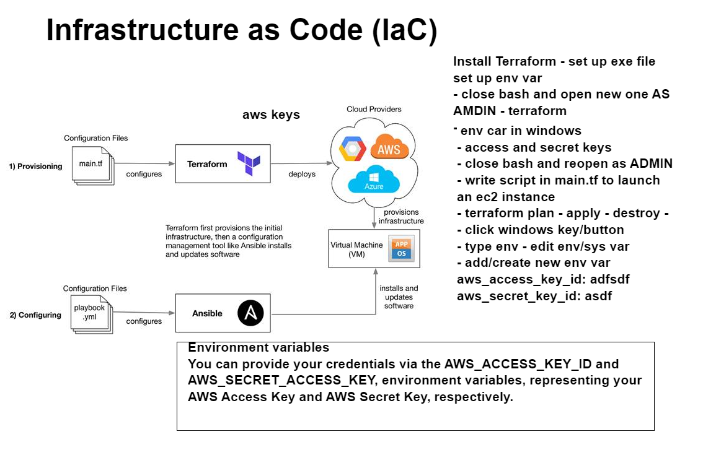

## Terraform
* Terraform is used for building infrastructure, e.g: services (like ec2), vpc's, subnets, whereas ansible is used to manage configurations within infrasturcture and services, e.g: provision instances with playbooks.
* Terraform has a vault similarly ansible.
* Terraform scripts are held in the `main.tf` file which is made locally
## Terraform advantages
* Terraform is user friendly
* Terraform documentation is easy to follow
* Terraform is a powerful tool which allows you to build infrastructure much faster than ansible
* Terraform takes fewer lines to build infrastructure as compared to ansible
## Terraform commands
* `terraform init` -> initializes a working directory containing Terraform configuration files. Downloads dependencies which are required by the cloud provider specified in `main.tf`
* `terraform plan` -> Scans the `main.tf` folder for errors
* `terraform apply` -> Runs the `main.tf` folder, sending the instructions to the target cloud provide so that the spefified infrastructure can be made
* `terraform destroy` -> Destroys the deployed infrastructure
## Installing terraform



**NOTE- this guide is for windows 10 users. The following video goes through the process, but the steps can also be seen below : https://www.youtube.com/watch?v=SkcRSJWNRS8&ab_channel=DevOpsGuy**
1) Use the following link to go to the download page: https://developer.hashicorp.com/terraform/downloads
2) Download the latest AMD version of terraform
3) Navigate to your download folder
4) Right click the zipped terraform file, and click `Extract all`
5) Click `Ok`
6) Enter the unzipped file and right click the application -> `Cut`
7) Navigate to your C drive
8) Make a new folder called terraform
9) Go inside the folder -> right click -> paste
10) Copy the path of the file which can be found at the top
11) In the windows search bar, type `env` and click `Edit the system environmental variables`
12) Click `Environmental variables...`
13) Under system variables, select the `PATH` variable and click `Edit`
14) On a new line, paste the terraform application path.
15) Save and exit every window
16) Open a new gitbash terminal
17) Run the following to see if terraform is installed properly:
```
terraform --version
```
## Securing AWS keys by making them environmental variables
1) In the windows search bar, type `env` and click `Edit the system environmental variables`
2) Click `Environmental variables...`
3) Under user variables, select `New`
4) For variable name, enter: `AWS_ACCESS_KEY_ID`
5) For variable value, enter: `your aws access key which can be found in your ~/.ssh folder`
6) Click `Ok`
7) Under user variables, select `New`
8) For variable name, enter: `AWS_SECRET_ACCESS_KEY`
9) For variable value, enter: `your aws secrett access key which can be found in your ~/.ssh folder`
10) Save and exit every window
## Launching an EC2 instance using terraform
1) Create a file called `main.tf`
2) Inside the file, add the following:
```
provider "aws" {
    region = "eu-west-1"
 } 
```
3) Run the following to create the terraform configuration file and to download dependencies for aws:
```
vagrant init
```
4) Enter the following code to speficy how to create the instance:
```
resource "aws_instance" "app_instance" {
  ami           = "ami-0495f6e6ed224deb2"
  instance_type = "t2.micro"
  associate_public_ip_address = true
  tags = {
      Name = "benas-tech201-terraform-app"
  }	
}
```
5) Run the following to check if there are errors with the script:
```
terraform plan
```
6) If no errors are present, run the following to build the instance:
```
terraform apply
```
7) To destroy the instance, run the following:
```
terraform destroy
```
## Terraform .gitignore list
* .terraform
* .terraform.lock.hcl
* terraform.tfstate
* terraform.tfstate.backup
* variable.tf